# Easy UI

[](https://github.com/Jason-chen-coder/easy_ui/actions/workflows/deploy-example.yml)

Online example: https://jason-chen-coder.github.io/easy_ui/

## Usage

```dart
import 'package:easy_ui/easy_ui.dart';
```

## Components
### EasyTheme
主题组件
```dart
    MaterialApp(
      builder: (context, child) {
        return EasyTheme(
          data: EasyThemeData(),
          child: child,
        );
      },
    );
```
使用`EasyTheme.of(context)`获取主题数据

### EasyDrawer
侧边栏骨架组件
```dart
    EasyDrawer(
      header: EasyDrawerTopBar(title: 'DrawerTitle'),
      body: Center(
        child: Text('Body'),
      ),
      footer: EasyDrawerFooterButton(
        text: 'FooterButton',
        onPressed: () {},
      ),
    );
```
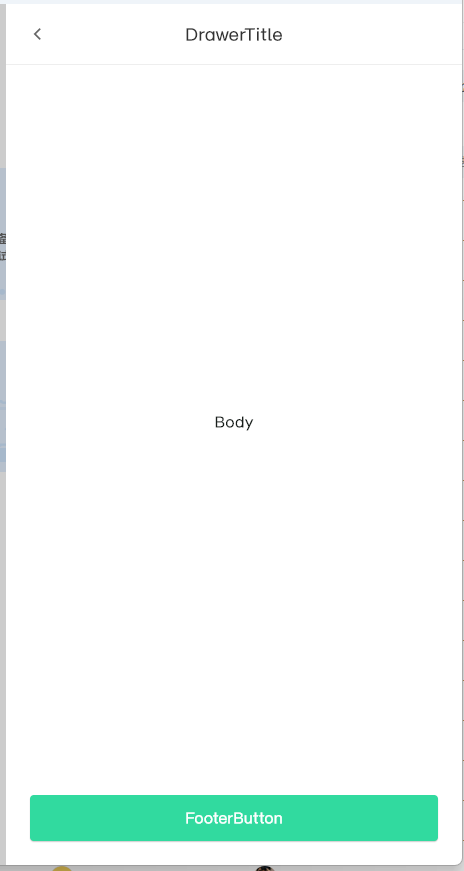

### EasyPopover
弹出层
```dart
CustomElevatedButton(
  onPressed: () {
    showEasyPopover(
      context: context,
      contentBuilder: (context) {
        return Center(
          child: Text('Popover Content'),
        );
      },
      direction: EasyPopoverDirection.top,
    );
  },
  text: 'Show Popover'
)
```
如果弹出层无法正常展示，请使用`Builder`组件包裹按钮组件，类似下面这样
```dart
Builder(builder: (context) {
  return CustomElevatedButton(
    onPressed: () {
      showEasyPopover(
        context: context,
        contentBuilder: (context) {
          return Center(
            child: Text('Popover Content'),
          );
        },
        direction: EasyPopoverDirection.top,
      );
    },
    text: 'Show Popover');
})
```
Dropdown（基于Popover封装）
```dart
 final items = [
  // 仅文本
  EasyDropdownListItem(
    value: 'text', 
    child: Text('仅文本'),
    onTap: (){
       print('点击了"仅文本"');
    }
  ),
  // 分割线
  EasyDropdownDivider<String>(),
  // 使用 Icon 和 Text
  EasyDropdownIconItem(
    value: 'icon_text',
    icon: Icon(
      Icons.home,
      size: 18,
      color: Colors.blue,
    ),
    label: Text(
      '首页',
      style: TextStyle(fontSize: 14, fontWeight: FontWeight.bold),
    ),
  ),
  // SVG 图标
  EasyDropdownIconItem<String>.fromSvg(
    value: 'svg_test',
    assetName: "assets/svgs/ic_easy.svg",
    label: 'svgicon',
  ),
];
Builder(builder: (context) {
  return CustomElevatedButton(
    onPressed: () {
      showEasyDropdown(
        context: context,
        items: items,
        direction: EasyPopoverDirection.top,
        onSelected: (value) => print('选中: $value'),
      );
    },
    child: 'Show Dropdown');
})
```

| EasyPopover                                            | EasyDropdown                                            |
|--------------------------------------------------------|---------------------------------------------------------|
| 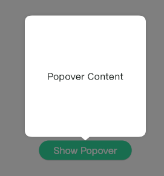 | 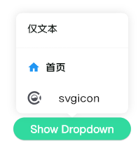 |

### EasyDataTable
数据表单。
```dart
                    EasyDataTable(
                      loadingData: organizationModel.isLoadingTenantUserList,
                      headerList: [
                        EasyDataTableHeaderData(
                          columnName: '序号',
                          header: EasyDataTableTextHeader(text: '序号'),
                        ),
                        EasyDataTableHeaderData(
                          columnName: '邮箱',
                          header: EasyDataTableTextHeader(text: '邮箱'),
                        ),
                        EasyDataTableHeaderData(
                          columnName: '用户名',
                          header: EasyDataTableTextHeader(text: '用户名'),
                        ),
                        EasyDataTableHeaderData(
                          columnName: '姓名',
                          header: EasyDataTableTextHeader(text: '姓名'),
                        ),
                        EasyDataTableHeaderData(
                          columnName: '状态',
                          header: EasyDataTableTextHeader(text: '状态'),
                        ),
                        EasyDataTableHeaderData(
                          columnName: '创建人',
                          header: EasyDataTableTextHeader(text: '创建人'),
                        ),
                        EasyDataTableHeaderData(
                          columnName: '创建时间',
                          header: EasyDataTableTextHeader(text: '创建时间'),
                        ),
                        EasyDataTableHeaderData(
                          columnName: '最新修改人',
                          header: EasyDataTableTextHeader(text: '最新修改人'),
                        ),
                        EasyDataTableHeaderData(
                          columnName: '最新修改时间',
                          header: EasyDataTableTextHeader(text: '最新修改时间'),
                        ),
                        EasyDataTableHeaderData(
                          columnName: '操作',
                          header: EasyDataTableTextHeader(text: '操作'),
                        ),
                      ],
                      rows: tenantUserList.asMap().entries.map((entry) {
                        final index = entry.key;
                        final user = entry.value;
                        final sequenceNumber = (pageNum - 1) * pageSize + index + 1;
                        return <Widget>[
                          EasyDataTableTextCell(text: sequenceNumber.toString()),
                          EasyDataTableTextCell(text: user.email),
                          EasyDataTableTextCell(text: user.username),
                          EasyDataTableTextCell(text: user.realName),
                          Align(
                            alignment: Alignment.centerLeft,
                            child: UserStatusIndicator(status: user.status),
                          ),
                          EasyDataTableTextCell(text: user.createBy),
                          EasyDataTableTextCell(text: user.createDate),
                          EasyDataTableTextCell(text: user.updateBy),
                          EasyDataTableTextCell(text: user.updateDate),
                          Row(
                            mainAxisAlignment: MainAxisAlignment.start,
                            crossAxisAlignment: CrossAxisAlignment.center,
                            children: [
                              Tooltip(
                                message: '修改用户',
                                child: IconButton(
                                    onPressed: () => _handleEditUser(user),
                                    iconSize: 20,
                                    padding: EdgeInsets.zero,
                                    icon: Image.asset(
                                        'assets/images/ic_table_edit_btn.png')),
                              ),
                              Tooltip(
                                message: '重置密码',
                                child: IconButton(
                                    padding: EdgeInsets.zero,
                                    onPressed: () => _handleResetPwd(user),
                                    iconSize: 20,
                                    icon: Image.asset(
                                        'assets/images/ic_table_lock_btn.png')),
                              ),
                              Tooltip(
                                message: '禁用/启用用户',
                                child: Transform.scale(
                                    scale: 0.7,
                                    child: Switch(
                                        value: user.status == 1,
                                        trackOutlineColor: WidgetStatePropertyAll(
                                            Colors.transparent),
                                        overlayColor: WidgetStatePropertyAll(
                                            Colors.transparent),
                                        onChanged: (val) async {})),
                              ),
                              ExcludeFocus(
                                child: DropdownButtonHideUnderline(
                                  child: Tooltip(
                                    message: "更多操作",
                                    child: DropdownButton2(
                                      customButton: Container(
                                        width: 30,
                                        height: 30,
                                        decoration: BoxDecoration(),
                                        child: Icon(
                                          Icons.more_horiz,
                                          color: Color(0xff747475),
                                        ),
                                      ),
                                      items: [
                                        ...UserTableMenuItems.itemsList.map(
                                          (item) => DropdownMenuItem<MenuItem>(
                                            value: item,
                                            child:
                                                UserTableMenuItems.buildItem(item),
                                          ),
                                        ),
                                      ],
                                      onChanged: (value) {},
                                      dropdownStyleData: DropdownStyleData(
                                        width: 104,
                                        offset: Offset(-75, 0),
                                        padding: EdgeInsets.zero,
                                        decoration: BoxDecoration(
                                          color: Colors.white,
                                          borderRadius: BorderRadius.circular(4),
                                          boxShadow: [
                                            BoxShadow(
                                              color: Color(0x401484FC),
                                              offset: Offset(0, 2),
                                              blurRadius: 3,
                                            ),
                                          ],
                                        ),
                                      ),
                                    ),
                                  ),
                                ),
                              ),
                            ],
                          ),
                        ];
                      }).toList(),
                      columnWidths: {
                        0: FixedTableSize(80),
                        1: FixedTableSize(220),
                        2: FixedTableSize(140),
                        3: FixedTableSize(140),
                        4: FixedTableSize(106),
                        5: FixedTableSize(140),
                        6: FixedTableSize(200),
                        7: FixedTableSize(140),
                        8: FixedTableSize(200),
                        9: FixedTableSize(220),
                      },
                      initialInvisibleColumnIndices: [3, 6, 7, 8],
                      frozenLeftColumnCount: 1,
                      frozenRightColumnCount: 1,
                      primaryColumnIndices: [0, 1],
                      emptyWidget: EasyEmptyView(),
                      searchPanel: Row(children: _buildSearchWidgets()),
                      operationWidgets: _buildOperationWidgets(organizationModel),
                    );
```
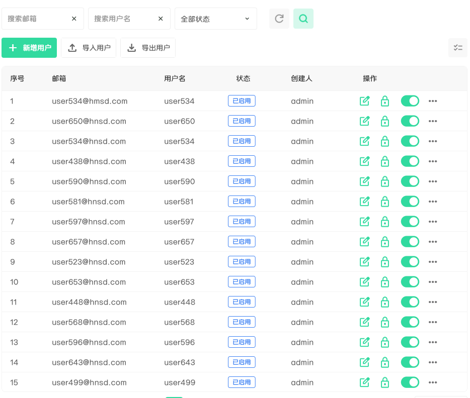

### EasyRecordCard
项目、功能岛执行记录卡片
```dart
  EasyRecordCard(
    title: '123456789',
    propertyColumns: [
      [
          '来自：张三',
          '开始时间：2025-07-08 14:31:39',
      ],
      [
          '执行人：admin',
          '用时：0:0:51',
      ],
    ],
    extra: Padding(
      padding: EdgeInsets.only(top: 8),
      child: Row(
        spacing: 16,
        children: [
          EasyStatusIndicator.gray(text: '已取消'),
          Expanded(
            child:
            EasyLinearProgressIndicator.green(
              progress: .5,
            ),
          ),
        ],
      ),
    ),
    endSideButtons: [
      EasyCardButton(
        text: '记录',
        icon: SvgPicture.asset(
          'assets/svgs/ic_record.svg',
          color: Colors.white,
        ),
        backgroundColor: EasyTheme.of(context).primaryGreen,
        onPressed: () {},
      ),
    ],
  );
```
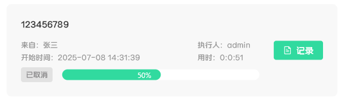

### EasyLinearProgressIndicator
线性进度条
```dart
Column(
  spacing: 8,
  children: [
    EasyLinearProgressIndicator(progress: .5),
    EasyLinearProgressIndicator.green(progress: .5),
    EasyLinearProgressIndicator.red(progress: .5),
    EasyLinearProgressIndicator.blue(progress: .5),
    EasyLinearProgressIndicator.amber(progress: .5),
  ],
);
```
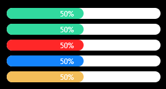

###  EasyMarqueeGradientBar

跑马灯进度条组件，支持自定义高度、宽度、背景色和滑块颜色。

```dart
EasyMarqueeGradientBar(
  height: 14,
  width: 300,
  backgroundColor: const Color(0xFFDDF8F2),
  barColor: const Color(0xFF3CDAA2),
)
```


### EasyTextFormField
表单文本输入框
```dart
EasyTextFormField(
  autovalidateMode: AutovalidateMode.onUnfocus, // 自动校验模式，为null时不会自动校验
  controller: _nameController,
  showRequiredMark: true, // 是否显示提示必填的*号
  decoration: InputDecoration(
    labelText: '角色名称',
  ),
  // 校验逻辑
  validator: (text) {
    if (text == null || text.isEmpty) {
      return '角色名称不能为空'; // 错误提示文本
    }
    return null; // 返回null表示通过校验
  },
)
```
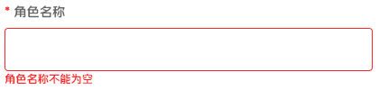

如果需要一次校验多个字段，使用material包的Form组件
```dart
final _formKey = GlobakKey<FormState>();

            Form(
              key: _formKey,
              child: Expanded(
                child: SingleChildScrollView(
                  child: Column(
                    children: [
                      EasyTextFormField(
                        autovalidateMode: AutovalidateMode.onUnfocus,
                        controller: _nameController,
                        showRequiredMark: true,
                        decoration: InputDecoration(
                          labelText: '角色名称',
                        ),
                        validator: (text) {
                          if (text == null || text.isEmpty) {
                            return '角色名称不能为空';
                          }
                          return null;
                        },
                      ),
                      const SizedBox(height: 16),
                      EasyTextFormField(
                        controller: _descriptionController,
                        decoration: InputDecoration(
                          labelText: '角色描述',
                          constraints: BoxConstraints.tightFor(height: 80),
                        ),
                        maxLines: null,
                        expands: true,
                        textAlignVertical: TextAlignVertical.top,
                      ),
                    ],
                  ),
                ),
              ),
            )

void fn() {
  // validate方法会触发所有继承FormField的子组件的validator回调.
  // 所有字段都通过校验时返回true.
  final validateResult = _formKey.currentState?.validate();
  // 重置表单
  _formKey.currentState?.reset();
  // 触发所有继承FormField的子组件的onSaved回调
  _formKey.currentState?.save();
}
```

还有两种带有suffix图标的变体
```dart
Column(
    spacing: 8,
    children: [
        EasyTextFormField(),
        EasyTextFormField.password(
        obscureText: false,
        onObscureTap: () {},
        ),
        EasyTextFormField.dropdownMenu(
        menuOpen: false, onTap: () {}),
    ],
)
```
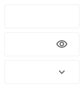

### EasyStatusIndicator
文字状态指示器组件
```dart
Column(
  spacing: 8,
  children: [
    EasyStatusIndicator(text: 'text'),
    EasyStatusIndicator.green(),
    EasyStatusIndicator.red(),
    EasyStatusIndicator.gray(),
    EasyStatusIndicator.orange(),
    EasyStatusIndicator.amber(),
    EasyStatusIndicator.blue(),
    EasyStatusIndicator.outlinedGreen(),
    EasyStatusIndicator.outlinedAmber(),
    EasyStatusIndicator.outlinedBlue(),
    EasyStatusIndicator.outlinedOrange(),
    EasyStatusIndicator.outlinedGray(),
    EasyStatusIndicator.outlinedRed(),
  ],
);
```
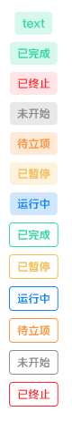

### EasySegments
多段选择器组件
```dart
    EasySegments(
      segments: [
        EasySegmentsItem('消息提醒', unread: true),
        EasySegmentsItem('设备消息', unread: false),
        EasySegmentsItem('系统通知')
      ],
      selectedIndex: 0,
      onSegmentChange: (index) {
        setState(() {
          _index = index;
        });
      },
    );
```
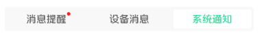

### EasyListSkeleton
列表加载骨架
```dart
EasyListSkeleton()
```
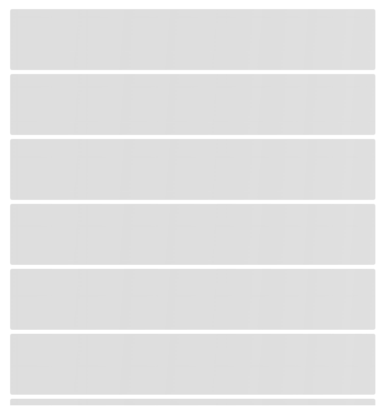

### EasyEmptyView
空视图,用于页面无数据时占位
```dart
EasyEmptyView()
```


### EasyPagination
分页组件
```dart
              EasyPagination(
                pageSize: pageSize,
                total: total,
                currentPage: pageNum,
                onPageChanged: _handlePageChanged,
                onPageSizeChanged: _handlePageSizeChanged,
              )
```
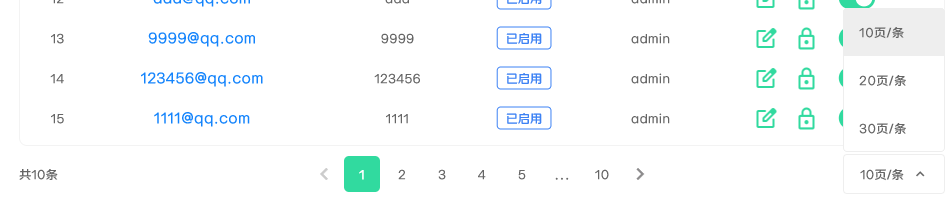

### EasyMenuAnchor
弹窗组件
```dart
    EasyMenuAnchor(
      childBuilder: (context, controller, child) {
        return FilledButton.icon(
          style: ElevatedButton.styleFrom(
            elevation: 0,
            shadowColor: Colors.transparent,
          ),
          onPressed: () {
            if (controller.isOpen) {
              controller.close();
            } else {
              controller.open();
            }
          },
          icon: Icon(
            controller.isOpen
                ? Icons.keyboard_arrow_up
                : Icons.keyboard_arrow_down,
          ),
          label: Text(controller.isOpen ? 'Close' : 'Open'),
        );
      },
      menuBuilder: (context, controller, overlayInfo) {
        return ConstrainedBox(
          constraints: BoxConstraints(maxHeight: 300, maxWidth: 300),
          child: ListView.builder(
            shrinkWrap: true,
            itemBuilder: (context, index) {
              final item = _items[index];
              return CheckboxListTile(
                key: ValueKey(item),
                title: Text('item$item'),
                value: item == _selected,
                onChanged: (value) {
                  if (value == true) {
                    setState(() {
                      _selected = item;
                    });
                  } else {
                    setState(() {
                      _selected = null;
                    });
                  }
                  controller.close();
                },
              );
            },
            itemCount: _items.length,
          ),
        );
      },
    );
```
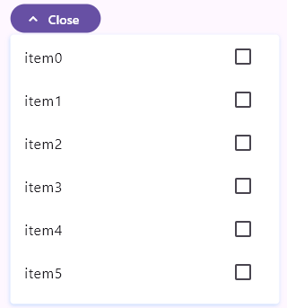

### EasySingleCheckPopMenu
弹窗单选组件
```dart
  EasySingleCheckPopMenu<int?>(
    value: value, // 选中值
    items: [null, 1, 0]
        .map((e) => EasySingleCheckPopMenuItem(
            label: switch (e) {
              1 => "已启用",
              0 => "已禁用",
              _ => "全部状态",
            },
            value: e))
        .toList(), // 菜单项
    onChanged: (value) { // 选中值变化回调
      _status.value = value;
    },
    elevation: WidgetStatePropertyAll(0),
    fixedSize: WidgetStatePropertyAll(Size(164, double.infinity)),
    anchorBuilder: (context, controller, child) { // 构造挂载菜单的组件函数
      return CustomTableSearchInput(
        label: '用户状态',
        controller: _searchStatusController,
        readOnly: true,
        suffixIcon: IconButton(
          icon: Icon(
            controller.isOpen
                ? Icons.keyboard_arrow_up
                : Icons.keyboard_arrow_down,
            size: 14,
          ),
          onPressed: () {
            if (controller.isOpen) {
              controller.close();
            } else {
              controller.open();
            }
          },
        ),
        onTap: () {
          if (controller.isOpen) {
            controller.close();
          } else {
            controller.open();
          }
        },
      );
    },
  );
```
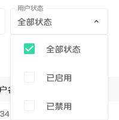

### EasyNotifyDialog
通知对话框
```dart
  showEasyNotifyDialog(
    context: context,
    builder: (context) {
      return EasyNotifyDialog(
        icon: Icon(
          Icons.check_circle,
          size: 50,
          color: Color(0xFF31DA9F),
        ),
        title: '导入成功',
        body: Text(
            '已成功导入${response?.userCount ?? 0}个用户，初始默认密码： ${response?.password ?? ''}(请注意邮件查收！)'),
        showActionsDividerLine: true,
        actions: EasyNotifyDialogTextButton(
          text: '好的',
          onPressed: () => Navigator.pop(context),
        ),
      );
    },
  );
```
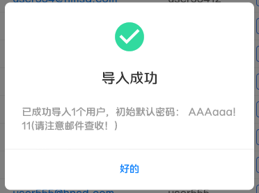

待两个按钮的变体
```dart
    showEasyNotifyDialog(
      context: context,
      builder: (context) {
        return EasyNotifyDialog.withTwoActions(
          icon: Image.asset(
            'assets/images/ic_alarm.png',
            width: 50,
            height: 50,
          ),
          title: '删除角色',
          body: Text(
            '删除后将会影响已授权的用户，请确认是否删除？',
            textAlign: TextAlign.center,
          ),
          leftAction: EasyNotifyDialogOutlinedButton(
            text: '取消',
            onPressed: () async {
              Navigator.of(context).pop();
            },
          ),
          rightAction: EasyNotifyDialogElevatedButton(
            text: '确认',
            onPressed: () async {
              Navigator.of(context).pop();
              final model = context.read<NexusUserModel>();
              try {
                GlobalLoading.show(context);
                await model.deleteRole(roleId);
                _loadRoleList();
              } catch (e, s) {
                ErrorHandler.instance.logToLocal('Error deleting role: $e, $s');
                showToast(text: "删除角色失败");
              } finally {
                GlobalLoading.hide();
              }
            },
          ),
        );
      },
    );
```
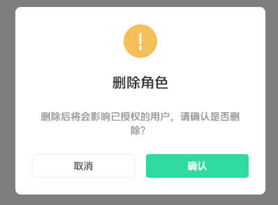

### EasyMarkdown
Markdown 渲染组件，支持 LaTeX 公式、代码高亮、图片预览、表格横向滚动等。

```js
EasyMarkdown(
  text: """
# 标题

支持 **粗体**、*斜体*、[链接](https://easy.studio)

## 表格

| 姓名 | 年龄 |
| ---- | ---- |
| 张三 | 18   |
| 李四 | 20   |
""",
)
```
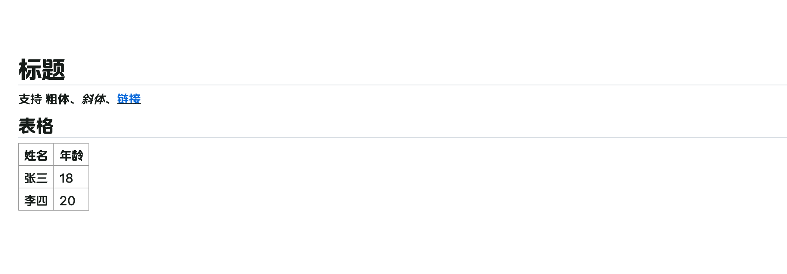

### EasyToast
全局Toast.使用前需要将`EasyToastWrapper`套在`MaterialApp`上.
```dart
EasyToastWrapper(
  child: MaterialApp(),    
);

showToastError(title: '错误吐司', description: '错误');
showToastWarning(title: '警告吐司', description: '警告');
showToastInfo(title: '提醒吐司', description: '提醒');
showToastOk(title: '成功吐司', description: '成功');
```
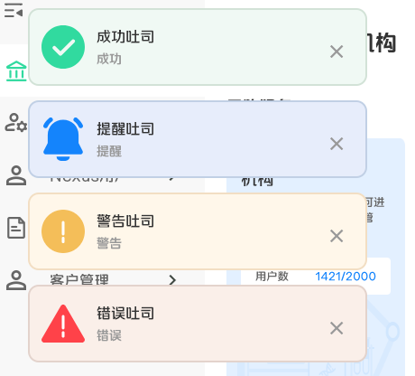

### PopupDateTimePicker
弹出式日期时间选择器
```dart
// 单个日期时间选择
EasyPopupSingleDateTimePicker(
  width: 300,
  placeholder: '请选择日期时间',
  onConfirm: (dateTime) {
    print('选择的日期时间: $dateTime');
  },
)
```
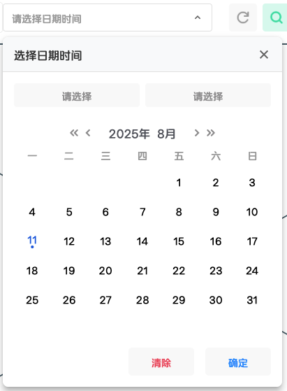
```dart

// 时间范围选择
EasyPopupRangeDateTimePicker(
  width: 300,
  placeholder: '请选择时间范围',
  onConfirm: (startDateTime, endDateTime) {
    print('开始时间: $startDateTime');
    print('结束时间: $endDateTime');
  },
)
```
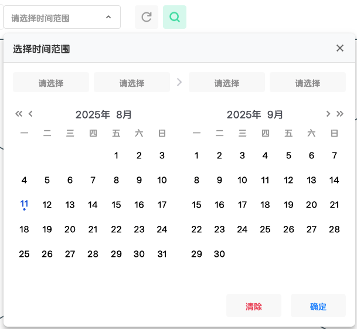

### EasyImageCropperDialog
图片裁剪弹窗，返回值为裁剪后的图片的`Uint8List`数据
```dart
final croppedImage = await EasyImageCropperDialog.show(
      context,
      title: '标题',
      imageProvider: FileImage(File(picked.path)), //源图片
    );
```
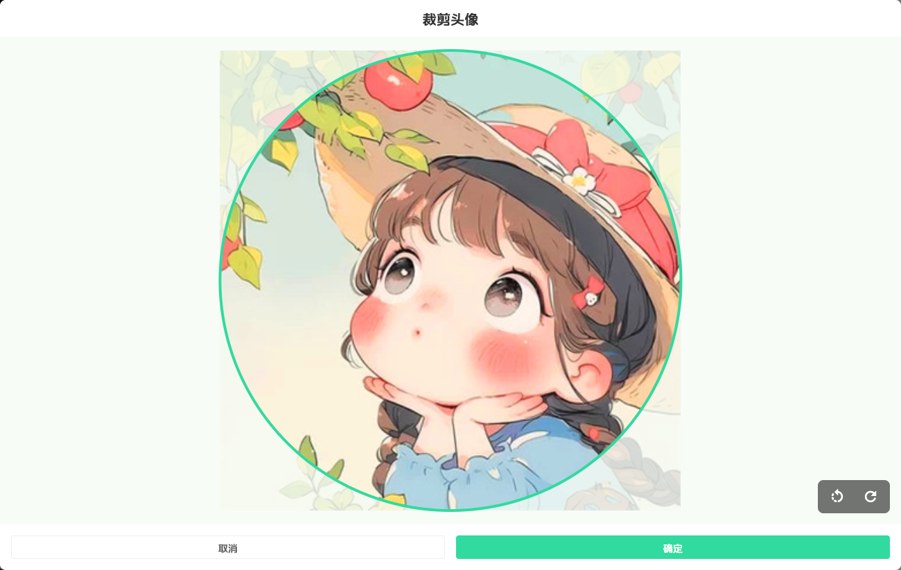
